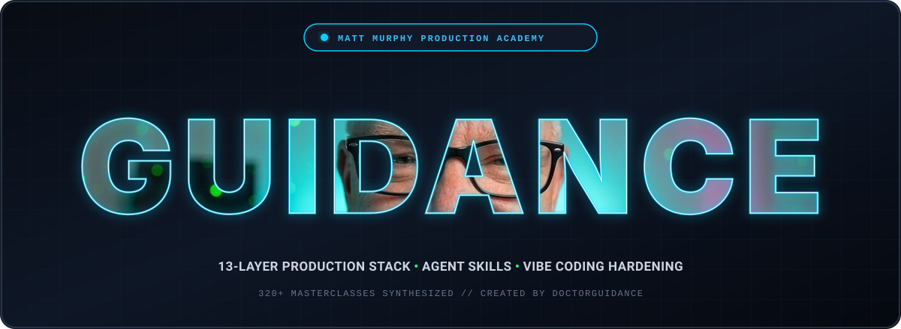

<p align="center">
  
</p>

# 🧠 Matt Murphy Production Engineering Academy & Agent Skills

> **Bridging the chasm between superficial "Vibe Coding" and hardened, scalable, enterprise-grade production engineering.**

[](https://doctorguidance.github.io/mattMurphyNotes/)
[](#)
[](#)
[](#)
[](#)

---

## 🌐 Live Interactive Academy (GitHub Pages)

The full interactive documentation, omnibox search engine, 13 production layers matrix, and **Production Audit Scorecard** are live on GitHub Pages:

👉 **[Enter the Live Matt Murphy Academy](https://doctorguidance.github.io/mattMurphyNotes/)**

### Key Platform Features:
- 🔍 **Real-Time Omnibox Search (`⌘K`):** Instantly filter across all 320+ masterclasses by episode number (`#043`), topics, vulnerability names (`IDOR`, `XSS`, `CSRF`, `DoS`), or keywords.
- 🌍 **Multilingual & RTL Support:** Switch seamlessly between **English (Default)**, **فارسی (Persian / RTL)**, **Deutsch**, **Español**, and **中文**.
- 🏛️ **13 Production Layers Matrix:** Visual navigation mapping software architecture layers directly to battle-tested failure modes and hardening guides.
- 📋 **Production Audit Scorecard:** Interactive 15-point checklist calculating your system's hardening score in real-time, with direct markdown report export.
- 💻 **Standardized Engineering Deep-Dives:** Every lesson features:
  - 🚨 **Problem Statement & Attack Vector**
  - 💡 **Root Cause & Architectural Solution**
  - ⚡ **Hardening Action Checklist**
  - 💻 **Hardened Code / Config with 1-Click Copy**
  - 🎧 **Direct Instagram Reel Link & Original Spoken Audio Transcript**

---

## 🏛️ The 12 Architectural Modules

All 320+ lessons are cataloged into 12 distinct engineering domains:

| Module Directory | Engineering Domain | Target Layer | Masterclasses |
|:---|:---|:---:|:---:|
| [`01-auth-identity`](./docs/01-auth-identity) | **Authentication, Identity & Session Management** | Layer 04 | 29 Lessons |
| [`02-security-defense`](./docs/02-security-defense) | **Application Security, Attacks & Multi-Layer Defense** | Layer 08 | 50 Lessons |
| [`03-database-storage`](./docs/03-database-storage) | **Database Architecture, Indexing & Data Durability** | Layer 03 | 34 Lessons |
| [`04-caching-performance`](./docs/04-caching-performance) | **Caching, Edge Distribution & System Performance** | Layer 10 | 12 Lessons |
| [`05-rate-limiting-abuse`](./docs/05-rate-limiting-abuse) | **Rate Limiting, Denial-of-Service & Bot Defense** | Layer 09 | 3 Lessons |
| [`06-observability-logs`](./docs/06-observability-logs) | **Observability, Structured Logging & Error Tracing** | Layer 12 | 14 Lessons |
| [`07-async-queues-webhooks`](./docs/07-async-queues-webhooks) | **Asynchronous Job Queues & Financial Webhooks** | Layer 06 | 18 Lessons |
| [`08-multi-tenancy`](./docs/08-multi-tenancy) | **Multi-Tenancy & Zero-Leak Data Isolation** | Layer 08 | 6 Lessons |
| [`09-ai-guardrails`](./docs/09-ai-guardrails) | **LLM Guardrails, Prompt Defense & Legal Compliance** | Layer 02 | 48 Lessons |
| [`10-cicd-deployments`](./docs/10-cicd-deployments) | **Testing, Staging Parity & Deployment Pipelines** | Layer 07 | 45 Lessons |
| [`11-cloud-finops`](./docs/11-cloud-finops) | **Cloud Resilience, Serverless & Cost Optimization** | Layer 06 | 30 Lessons |
| [`12-frontend-api-hygiene`](./docs/12-frontend-api-hygiene) | **Frontend Architecture & API Hygiene** | Layer 01 | 32 Lessons |

---

## 🤖 AI Agent Skill Suite (`matt-murphy-production-engineer`)

This repository provides an autonomous **Agent Skill** that injects Matt Murphy's production guardrails into AI programming environments to prevent vulnerable code generation.

### 1. In Google Antigravity
Copy the skill into your project's `.gemini/skills/` directory:
```bash
cp -r skills/matt-murphy-production-engineer/ ~/.gemini/skills/
```

### 2. In Cursor IDE
Append the production rules to your project's `.cursorrules`:
```bash
cat skills/matt-murphy-production-engineer/SKILL.md >> .cursorrules
```

### 3. In Claude Code & Windsurf
Reference [`SKILL.md`](./skills/matt-murphy-production-engineer/SKILL.md) directly in your project prompt or workspace instructions (`CLAUDE.md` / `AGENT.md`).

---

## 🛠️ CLI Static Codebase Auditor (`audit_codebase.py`)

Quickly scan any existing project before deployment for critical Matt Murphy anti-patterns (such as tokens in `localStorage`, unverified payment webhooks, or exposed secrets):

```bash
python scripts/audit_codebase.py /path/to/your/project
```

Sample output:
```text
🚨 FOUND 2 POTENTIAL PRODUCTION RISKS:

[CRITICAL] Insecure Token Storage in LocalStorage (MM-043)
  📍 File: src/auth/client.ts:42
  📌 Match: localStorage.setItem('token', jwt)
  💡 Remediation: Move authentication tokens to HttpOnly, Secure, SameSite=Lax cookies.
  📚 Matt Murphy Masterclass: Episode #043
```

---

## 📁 Repository Structure

```text
mattMurphyNotes/
├── .github/
│   └── workflows/
│       └── deploy-pages.yml          # Automated GitHub Pages CI/CD workflow
├── docs/                             # Full markdown documentation (320+ lessons)
│   ├── 01-auth-identity/
│   ├── 02-security-defense/
│   └── ...
├── site/                             # Interactive GitHub Pages web app
│   ├── index.html
│   ├── app.js
│   └── data.json                     # 1.2MB compiled lesson database
├── skills/                           # Executable AI Agent Skill Suite
│   └── matt-murphy-production-engineer/
│       ├── SKILL.md                  # Master agent system rules
│       └── rules/                    # Modular domain rulesets
├── scripts/
│   └── audit_codebase.py             # CLI codebase linter
├── banner.svg
└── README.md
```

---

## 📜 License & Acknowledgments
All original insights and video concepts belong to **Matt Murphy** ([@mattmurphyai](https://www.instagram.com/mattmurphyai) / [mattmurphy.ai](https://mattmurphy.ai)). This open-source systematization, interactive learning hub, and AI agent skills are maintained by DoctorGuidance under the **MIT License**.
